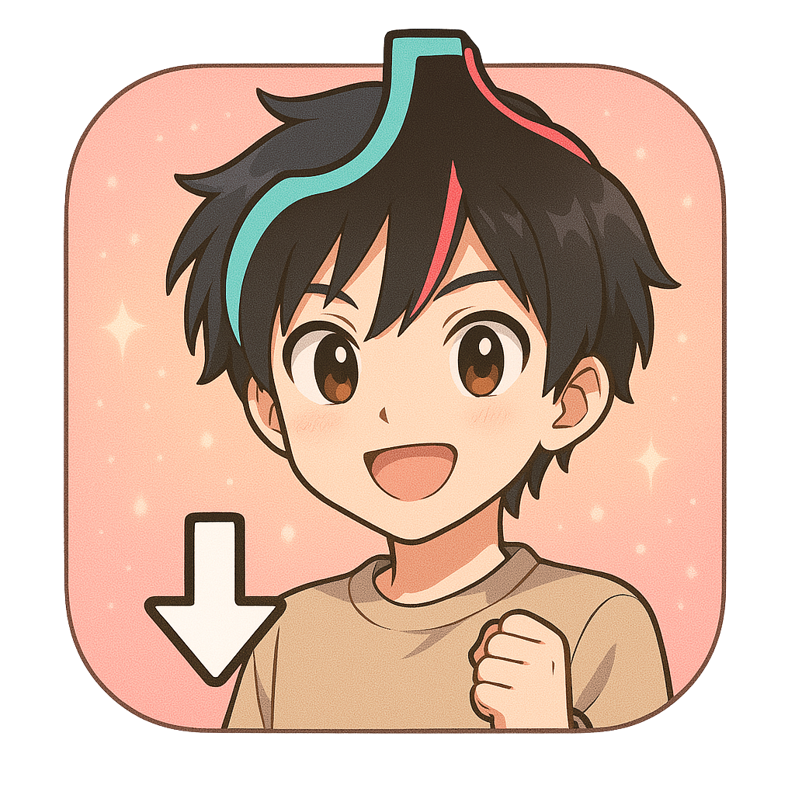
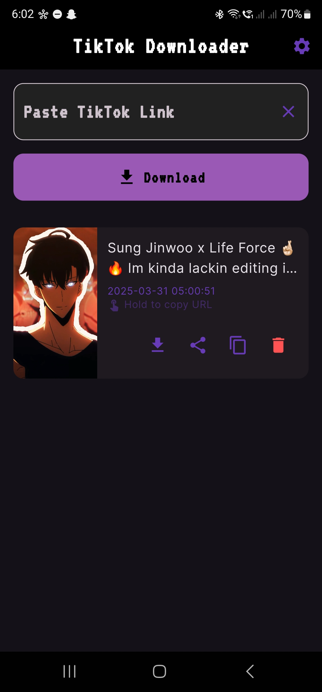
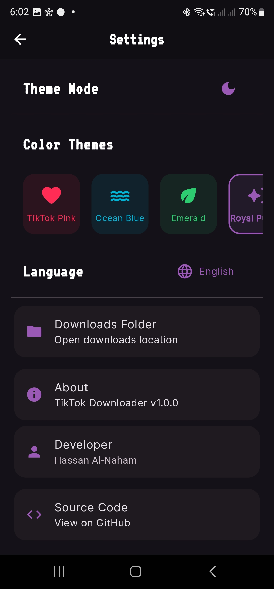

# TikTok Downloader App 📱

<div align="center">
  
</div>

A modern and user-friendly Flutter application that allows you to download TikTok videos without watermark. Built with Flutter and featuring a beautiful Material Design interface.

<div align="center">
  &nbsp;&nbsp;&nbsp;&nbsp;
  
</div>

## ✨ Features

- 🎥 Download TikTok videos without watermark
- 🌓 Dark/Light theme support
- 🌍 Multi-language support
- 📱 Modern and intuitive user interface
- 💾 Easy video management
- 📂 Automatic storage permission handling
- 🎨 Customizable accent colors
- 📱 Responsive design for all screen sizes

## 🚀 Getting Started

### Direct Download

📱 [Download Latest APK](https://github.com/imcr1/TiktokDL-APP/releases/download/tikdl/app-armeabi-v7a-release_1.apk)

> Note: This APK is for ARM devices (most Android phones). Make sure to enable installation from unknown sources in your device settings.

### Build from Source

#### Prerequisites

- Flutter SDK
- Android Studio / VS Code
- Git

#### Installation

1. Clone the repository
```bash
git clone https://github.com/imcr1/TiktokDL-APP.git
```

2. Navigate to the project directory
```bash
cd TiktokDL-APP/src
```

3. Install dependencies
```bash
flutter pub get
```

4. Run the app
```bash
flutter run
```

## 🛠️ Built With

- [Flutter](https://flutter.dev/) - UI Framework
- [GetX](https://pub.dev/packages/get) - State Management
- [Permission Handler](https://pub.dev/packages/permission_handler) - Permission Management
- [Google Fonts](https://pub.dev/packages/google_fonts) - Typography
- [Get Storage](https://pub.dev/packages/get_storage) - Local Storage

## 📝 License

This project is licensed under the MIT License - see the [LICENSE](LICENSE) file for details.

## 🤝 Contributing

Contributions, issues, and feature requests are welcome! Feel free to check the [issues page](https://github.com/yourusername/TiktokDL-APP/issues).

## ⭐️ Show your support

Give a ⭐️ if this project helped you!

## 📸 Screenshots

The app features a clean and modern interface with support for both light and dark themes. The screenshots above showcase the main functionality and user interface of the application.
